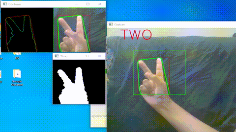

# Hand-Gesture-Recognition :

This code helps you to understand the numbers displayed through your fingers using webcam. Adjusting the brightness of screen varies result. 
Try to position hand completely in the box and avoid arm or wrist coming in the box(as it will change the arearatio).

# Working Example:

# Code Requirements :
(a) opencv
(b) math
(c) numpy

# Installing the required packages:
To install the opencv package use the following command:

-> pip install opencv-python

To install the maths package use the following command:

-> pip install maths

To install the numpy package use the following command:

-> pip install numpy

# Steps to Build this project:
(1) At first we will be importing the required packages

(2) Open the inbuilt Camera

(3) Now we will capture the frames from the camera

(4) After that we will be getting the hand data from the rectangle sub window

(5) Apply Gaussian blur

(6) Get the HSV image

(7) Create a binary image with where white will be skin colors and rest is black

(8) Apply morphological transformations to filter out the background noise

(9) Apply Gaussian Blur and Threshold

(10) Show threshold image

(11) Find contours with maximum area

(12) Create bounding rectangle around the contour

(13) Find the convex hull and draw the contours

(14) Find convexity defects by using the cosine rule to find angle of the far point from the start and end point i.e. the convex points (the finger tips) for all defects

(15) Print number of fingers-output

(16) Show required images and close the camera if 'Q' is pressed

# Execution:
To run the code, type the following command:

-> python hand_gesture.py

